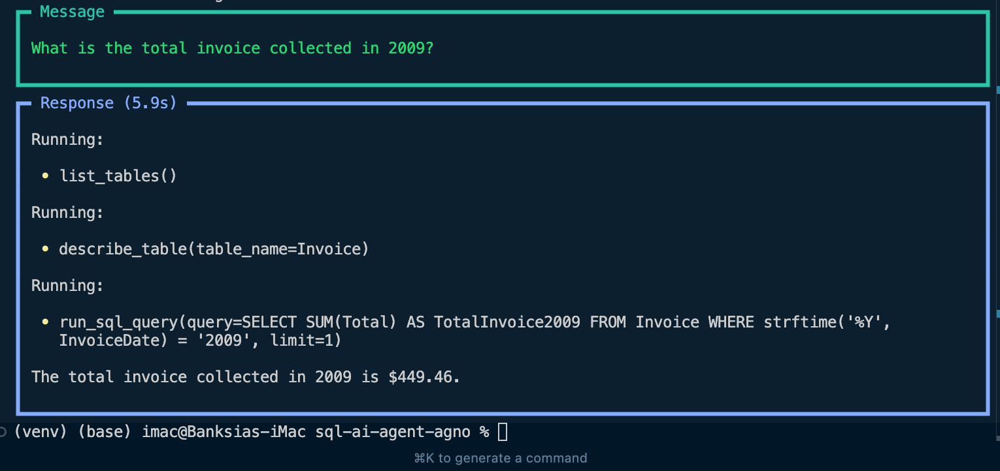

# SQL AI Agent | Powered by Agno 🤖


An intelligent SQL agent powered by OpenAI and Agno framework that helps you interact with SQLite databases using natural language. This project allows users to query and analyze SQLite databases through conversational AI, making database interactions more intuitive and accessible.

## Badges 🚩

[](https://www.python.org/)
[](https://openai.com/)
[](https://www.sqlite.org/)
[](https://choosealicense.com/licenses/mit/)

## Features 🌟

- Natural language to SQL query conversion
- Interactive database exploration
- Support for complex SQL operations
- Error handling and query validation
- Secure API key management
- Agno framework for building intelligent agents



## Installation 📦

1. Clone the repository
```bash
git clone https://github.com/pakagronglb/sql-ai-agent-agno.git
cd sql-ai-agent-agno
```

2. Create a virtual environment
```bash
python -m venv venv
source venv/bin/activate  # On Windows use: venv\Scripts\activate
```

3. Install dependencies
```bash
pip install -r requirements.txt
```

## Environment Variables 🔑

Create a `.env` file in the project root and add the following:

```env
OPENAI_API_KEY=your_openai_api_key
```

## Usage/Examples 📝

```python
from sqlite_agent import SQLiteAgent

# Initialize the agent
agent = SQLiteAgent("path_to_your_database.sqlite")

# Query using natural language
result = agent.query("Show me all customers from Germany")

# Print results
print(result)
```

## Tech Stack 💻

- Python 3.8+
- OpenAI API
- SQLite3
- Python-dotenv
- Agno Framework

## Contributing 🤝

Contributions are welcome! Please feel free to submit a Pull Request.

1. Fork the project
2. Create your feature branch
```bash
git checkout -b feature/AmazingFeature
```
3. Commit your changes
```bash
git commit -m 'Add some AmazingFeature'
```
4. Push to the branch
```bash
git push origin feature/AmazingFeature
```
5. Open a Pull Request

## License 📝

This project is licensed under the MIT License - see the [LICENSE](LICENSE) file for details.

## Acknowledgements 🤝

- [JieJenn YouTube Tutorial](https://www.youtube.com/watch?v=SH3R8ryfR04) - For the inspiration and guidance in creating this SQL AI agent
- [Agno](https://www.agno.com/) - For providing the powerful agent framework that makes this project possible
- OpenAI for providing the powerful language model API
- SQLite team for the excellent database engine

## Author

- [@pakagronglb](https://github.com/pakagronglb)

## 🔗 Links
[](https://www.youtube.com/watch?v=SH3R8ryfR04)
[](https://github.com/yourusername/sql-ai-agent-agno) 